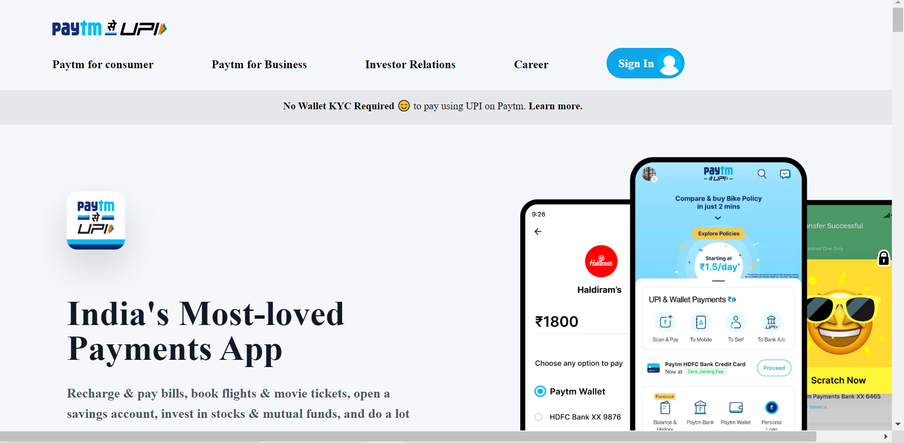

# Paytm clone

# **Project-Paytm** [LIVE LINK](https://paytmc-lone.netlify.app/)
>- Skills gained in this project
 >- learned about responsiveness by using talwind css
 >- learned abou responsiveness breakpoints for different screen sizes
 >- learned about how to use talwnd css
 >- learned about how to use hover in talwind css
 
 **Time taken to finish to this project**
 
 >-It took me 6 hour to complete this project 

 **Screenshot**
 